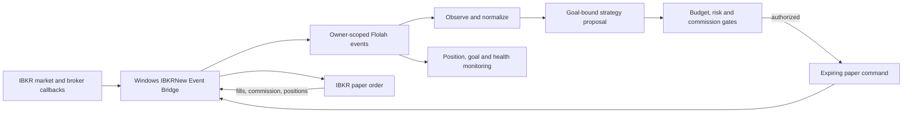

# IBKRNew event-driven paper trading

IBKRNew0 is Flolah’s event-driven workflow for Interactive Brokers paper accounts. It supports long and short US stocks plus long calls and puts, with configurable goals, strategies, universes, budgets and risk limits.

It is a separate product flow from the older monthly IBKR workflows. It does not change or reuse their plans, ledgers or desktop credentials.

> Trading involves risk. This feature is paper-only and does not promise a return. Test the full lifecycle with your own paper account and data permissions.

## Why a desktop bridge is required

IB Gateway and TWS expose their trading API on your computer. Flolah’s cloud service cannot connect directly to that local socket.

The downloadable **IBKRNew Event Bridge** runs beside Gateway/TWS and makes outbound secure connections to Flolah. It receives broker callbacks, calculates configured market features, sends events, claims short-lived paper commands, rechecks them locally and submits eligible orders to the paper account. It opens no public listener.

If the bridge, Gateway, account snapshot or required market data is stale, new entries stop. Existing broker-hosted protective orders remain at IBKR, and reconciliation resumes when the connection returns.

## Event flow

There is no cloud price-polling loop and no workflow that waits all day. Six short event reactions observe markets, plan proposals, check risk, deliver commands, monitor positions and supervise health. The strategy planner cannot authorize or place orders; deterministic gates make that decision.

## Configure IBKRNew0

Open **Prebuilt Workflows → IBKRNew0**:

- **Strategy** configures the outcome goal, trading logic/skill, risk policy, universe and market-data requirements.
- **Summary** reports goal progress, realized results after commissions and allocation decisions.
- **Live Operations** reports bridge and Gateway health, positions, executions, approvals, errors and retained history.

Saving a configuration publishes a new version for your company. Existing authorizations remain tied to the exact versions used for their checks.

### Goal versus strategy

The **goal** defines what success means and when the cycle ends. The default is configurable: 5% net realized return in 30 calendar days. Goal progress is based on closed trades after actual commissions.

The **strategy** chooses which eligible opportunities may pursue that goal. It cannot override the goal or risk policy.

In one-time mode, new entries stop when the target or deadline arrives and remain stopped until you activate a new goal. In perpetual mode, the next cycle starts only at its normal boundary. Positions already open can still be protected, reduced or closed.

### Default paper limits

The supplied conservative-to-moderate baseline starts with:

- USD 10,000 maximum total gross exposure;
- USD 1,000 maximum new opening exposure per day;
- independently configurable long stock, short stock, long call and long put switches;
- short selling for stocks only—no short or naked options;
- position, daily/weekly loss, drawdown and consecutive-loss limits;
- commission-aware sizing and minimum expected net profit.

Every value is configurable, but the paper-only safety floor and unsupported-product restrictions cannot be disabled. Short-sale proceeds and unused broker buying power do not increase Flolah’s configured total budget.

## Universe and data

You can narrow stock candidates by configured stock-index membership. ETFs use their own filters, separate from stock-index selection. Price, volume, spread, liquidity, exclusions, shortability and option-chain requirements further reduce the eligible set.

IBKR supplies executable quotes, bars and broker/account truth through the desktop bridge. Optional licensed profiles can add instrument reference data, index/ETF membership, fundamentals and corporate events. Fundamentals help eligibility and event-risk filtering; they are not the live price trigger.

## Set up safely

1. Install IB Gateway or TWS on the Windows trading PC and sign in to a paper account.
2. Enable the local broker API using IBKR’s paper-session guidance.
3. In Flolah, open **Connectors → IBKRNew Event Bridge** and download the full or lite package.
4. Extract it into a private folder and configure the local Gateway connection.
5. Keep the downloaded token and environment file private. Enter the paper account only on the desktop—not in Flolah.
6. Start observe-only and confirm healthy Gateway, market-data and reconciliation status in **IBKRNew0 → Live Operations**.
7. Explicitly enable local paper execution only after those checks pass.

One bridge service runs on the desktop. The six reactions run in Flolah, so there is no separate workflow package to download. Revoke an old bridge from Live Operations or Tokens management if a machine is retired or credentials may have been exposed.

## Paper trading only

The label means orders can be sent only to an IBKR paper account. Live execution is disabled by the server policy and by the desktop bridge. Advisory or approval-required modes may make the flow more restrictive.

Flolah does not need the real IBKR account number in its cloud database. It uses an opaque account reference for owner-scoped events and reports. Never paste account numbers, tokens, environment files, statements or credential-bearing logs into chat, public issues or shared documents.

## Related

- [Connectors and MCP](./connectors-and-mcp.md)
- [Desktop for Windows](../operate/desktop-windows.md)
- [Budgets](../operate/budgets.md)
- [Security and tokens](../operate/security-tokens.md)
