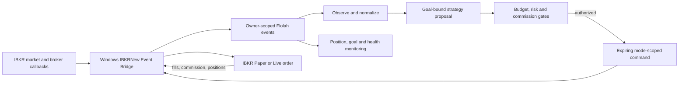

# IBKRNew event-driven Paper and Live trading

IBKRNew0 is Flolah’s event-driven workflow for Interactive Brokers Paper and Live accounts. It supports long and short US stocks plus long calls and puts, with configurable goals, strategies, universes, budgets and risk limits.

It is a separate product flow from the older monthly IBKR workflows. It does not change or reuse their plans, ledgers or desktop credentials.

> Trading involves risk and no return is promised. Paper is the default. Test the full lifecycle and verify your broker permissions before deliberately enabling Live.

## Why a desktop bridge is required

IB Gateway and TWS expose their trading API on your computer. Flolah’s cloud service cannot connect directly to that local socket.

The downloadable **IBKRNew Event Bridge** runs beside Gateway/TWS and makes outbound secure connections to Flolah. It receives broker callbacks, calculates configured market features, sends events, claims short-lived mode-scoped commands, rechecks them locally and submits eligible orders to the selected environment. It opens no public listener.

If the bridge, Gateway, account snapshot or required market data is stale, new entries stop. Existing broker-hosted protective orders remain at IBKR, and reconciliation resumes when the connection returns.

## Event flow

```mermaid
flowchart LR
  Market[IBKR market and broker callbacks] --> Bridge[Windows IBKRNew Event Bridge]
  Bridge --> Events[Owner-scoped Flolah events]
  Events --> Observe[Observe and normalize]
  Observe --> Strategy[Goal-bound strategy proposal]
  Strategy --> Risk[Budget, risk and commission gates]
  Risk -->|authorized| Command[Expiring mode-scoped command]
  Command --> Bridge
  Bridge --> Broker[IBKR Paper or Live order]
  Broker -->|fills, commission, positions| Bridge
  Events --> Monitor[Position, goal and health monitoring]
```

There is no cloud price-polling loop and no workflow that waits all day. Six short event reactions observe markets, plan proposals, check risk, deliver commands, monitor positions and supervise health. The strategy planner cannot authorize or place orders; deterministic gates make that decision.

## Configure IBKRNew0

Open **Prebuilt Workflows → IBKRNew0**:

- **Strategy** configures the outcome goal, trading logic/skill, risk policy, universe and market-data requirements.
- **Summary** reports goal progress, realized results after commissions and allocation decisions.
- **Live Operations** reports bridge and Gateway health, positions, executions, approvals and errors, plus the correlated state of all six runtime roles. Its causal timeline is paginated on the server, describes each event in plain language and loads the ordered role-by-role lifecycle only when you open an event.

Saving a configuration publishes a new version for your company. Existing authorizations remain tied to the exact versions used for their checks.

The **Paper / Live** control on Strategy changes only the selected broker account context. Both contexts run the same strategy, universe, budgets, planner, deterministic risk checks, command path, and desktop bridge code. Each context has its own goal and progress, account projection, positions, reservations, orders, fills, commissions, events, and reports. Selecting either context does not immediately permit orders: its matching bridge must attest the local account and Gateway session first.

### Goal versus strategy

The **goal** defines what success means and when the cycle ends. The default is configurable: 5% net realized return in 30 calendar days. Goal progress is based on closed trades after actual commissions.

The **strategy** chooses which eligible opportunities may pursue that goal. It cannot override the goal or risk policy.

In one-time mode, new entries stop when the target or deadline arrives and remain stopped until you activate a new goal. In perpetual mode, the next cycle starts only at its normal boundary. Positions already open can still be protected, reduced or closed.

### Default risk limits

The supplied conservative-to-moderate baseline starts with:

- USD 10,000 maximum total gross exposure;
- USD 1,000 maximum new opening exposure per day;
- independently configurable long stock, short stock, long call and long put switches;
- short selling for stocks only—no short or naked options;
- position, daily/weekly loss, drawdown and consecutive-loss limits;
- commission-aware sizing and minimum expected net profit.

Every value is configurable, but account attestation, mode matching, local execution gates and unsupported-product restrictions cannot be disabled. Short-sale proceeds and unused broker buying power do not increase Flolah’s configured total budget.

## Universe and data

You can narrow stock candidates by configured stock-index membership. ETFs use their own filters, separate from stock-index selection. Price, volume, spread, liquidity, exclusions, shortability and option-chain requirements further reduce the eligible set.

IBKR supplies executable quotes, bars and broker/account truth through the desktop bridge. Optional licensed profiles can add instrument reference data, index/ETF membership, fundamentals and corporate events. Fundamentals help eligibility and event-risk filtering; they are not the live price trigger.

## Set up safely

1. Install IB Gateway or TWS on the Windows trading PC and sign in to the intended Paper or Live account.
2. Enable the local broker API for that session.
3. In Flolah, open **Connectors → IBKRNew Event Bridge** and download the Paper or Live full/lite package.
4. Extract it into a private folder and configure the local Gateway connection.
5. Keep the downloaded token and environment file private. Enter the matching account only on the desktop—not in Flolah.
6. Run the offline test and then `scripts\Install-IBKRNewBridgeTask.ps1`. This creates the supervised `IBKRNewBridge` Windows Scheduled Task under the signed-in user and starts it.
7. Confirm healthy Gateway, market-data and reconciliation status in **IBKRNew0 → Live Operations**. Local task status is available through `scripts\Get-IBKRNewBridgeTaskStatus.ps1`.
8. Explicitly enable the single local `IBKRNEW_EXECUTION_ENABLED` gate after those checks pass. Select the matching Paper or Live account context on Strategy; it remains blocked until `managedAccounts` attestation succeeds.

One supervised bridge process runs on the desktop. It starts at Windows sign-in, retries after process failure or a missed start, and reconnects to Gateway after Modern Standby. A legacy Paper-only package is migrated in place to the common execution gate and explicit Paper selector without replacing its token, account or other local settings. The validated, owner-protected installed `.env` overrides stale `IBKRNEW_*` values retained by Task Scheduler. Cloud calls have bounded timeouts, and a progress watchdog deliberately exits a wedged runtime so the supervisor restarts it rather than leaving a Running task with a stale heartbeat. At startup the server self-heals its registration cursor from accepted event history before the bridge reconciles its local sequence and preserves incompatible queued events separately, preventing a backend restart, reinstall or re-registration from causing permanent heartbeat quarantine. Gateway authentication remains interactive: if the broker session expires, new trading fails closed until the user signs in again. The six reactions run in Flolah, so there is no separate workflow package to download. Revoke an old bridge from Live Operations or Tokens management if a machine is retired or credentials may have been exposed.

### Read the six-role audit

The six cards in **Live Operations** are service-driven trading roles, not generated chat messages. They show what each role last handled, its workflow identity, responsibility and current state. Open **View lifecycle** on a causal event to see the same signal move through observation, planning, deterministic risk checks, approval/command delivery, position monitoring and supervision. Evidence IDs correlate the original event with any authorization, command, trade and execution.

Only one page of timeline events for the selected Paper or Live mode is returned at a time. Event payloads and persisted decision detail are fetched on demand, while health and account projections use a separate bounded refresh. The timeline and its decision evidence follow the CEO profile's retention setting. If the owner returns to Paper while live positions or orders remain, Live Operations keeps a red live-exposure reconciliation warning visible until the live bridge reports them closed or cancelled.

Frequent account refreshes keep the deterministic risk gate current. They do not create an equivalent number of historical snapshot rows: Flolah retains a snapshot when position/order structure changes and a checkpoint at most every five minutes. A daily purge applies the CEO profile's selected 30, 60, 90, 120 or 365-day retention period; the default is 90 days.

## Live activation and privacy

Paper is selected by default. The toggle records which isolated account context the owner wants to operate. Orders remain blocked until an online bridge for that context proves that its locally configured account is present in IBKR’s managed accounts and has the expected Paper (`DU…`) or Live (non-`DU…`) classification. A Paper bridge cannot claim Live commands and a Live bridge cannot claim Paper commands. Switching contexts cancels unsubmitted entries from the prior context without copying its goal or progress; existing Live positions and broker-hosted protection remain visible for reconciliation.

Flolah does not need the real IBKR account number in its cloud database. It uses an opaque account reference for owner-scoped events and reports. Never paste account numbers, tokens, environment files, statements or credential-bearing logs into chat, public issues or shared documents.

## Related

- [Connectors and MCP](./connectors-and-mcp.md)
- [Desktop for Windows](../operate/desktop-windows.md)
- [Budgets](../operate/budgets.md)
- [Security and tokens](../operate/security-tokens.md)
