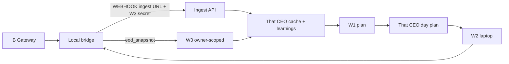

# IBKR Local Bridge (laptop)

Phase 2 of the [Monthly Positive Return plan](IBKR-MONTHLY-TRADING-PLAN.md): a loopback HTTP service on the trading laptop that wraps `backend/src/services/ibkr-gateway-client.js`, **polls** Gateway, and POSTs fill / equity / **account snapshot** events to the VPS ingest API (`/api/ibkr-trading/local-bridge-webhook`, W3 hook secret). The W3 **workflow** runs on **EOD** by default.

**CEO end-user guide (prerequisites, setup, run/monitor, VPS deploy, privacy):** [platform-help/20-ibkr-monthly-trading.md](platform-help/20-ibkr-monthly-trading.md).
**Summary UI** reads execution order ids from flat `order_ids` or nested/stringified W2 `execute` / `place_bracket.results` so day-row ORDERS match laptop brackets.

**Data isolation:** webhook events update **only the CEO** who owns the W3 workflow (the ingest URL authenticates with that workflow’s hook secret). IBKR cloud tables are keyed by `owner_user_id` — not shared across users.

**Workflow roles (W1–W5):** W1 plans (cloud) · W2 executes (laptop → this bridge) · W3 event graph on **EOD** (journal/notify/start W1; secret also binds the ingest URL) · **W4 unused** · W5 weekly email. Full names/goals/outcomes: [platform-help/20-ibkr-monthly-trading.md](platform-help/20-ibkr-monthly-trading.md), [IBKR-MONTHLY-WORKFLOWS.md](IBKR-MONTHLY-WORKFLOWS.md).

**Cloud UI:** [IBKR Summary](platform-help/20-ibkr-monthly-trading.md#ibkr-summary-page-ibkr-summary) (`/ibkr-summary`) shows plan vs executed and can **clear transactional** data without wiping budget Variables.

**Download (recommended):** CEO or admin → **Connectors** → **Local IBKR bridge** → **Download local IBKR bridge** (Windows zip with optional portable Node; mints `LOCAL_BRIDGE_TOKEN` into `.env`). Lite download omits Node. Paste the same token into W2 variable `local_bridge_token`.

**API:** `GET /api/integrations/ibkr-bridge/package?include_runtime=0|1` (CEO/admin session).

**Package source:** `backend/local-ibkr-bridge/` — see that folder’s [README](../backend/local-ibkr-bridge/README.md) for install, env, Task Scheduler, and W2 URL examples.

## Role in the architecture

| Component | Where | Role |
|-----------|--------|------|
| IB Gateway / TWS | Laptop | Socket API (paper 4002) |
| **local-ibkr-bridge** | Laptop `127.0.0.1:3010` | Auth’d JSON API; **polls** Gateway (timer default 300s); POST ingest URL |
| W2 Execution | Laptop desktop package | Calls bridge at market open; `/execute-day-plan` skips BUY limits far from live last |
| Ingest API | VPS `POST /api/ibkr-trading/local-bridge-webhook` | Same **W3 hook secret**; persists book/fills immediately; **starts W3 only** on `eod_snapshot` or `fanout_w3=1` |
| W3 Event Handler | VPS workflow | EOD (default): journal, `notify_ceo`, guardrail, **start W1** |

## Simple end-to-end (ops)



The laptop does **not** subscribe to a live IBKR fill stream. Fills after place are seen on the **next poll/snapshot**. Default `WEBHOOK_URL` is the ingest API, not `/api/agent-workflows/hooks/monthly-trading-w3-events`.

## Auth and bind

- Bind: `BRIDGE_HOST=127.0.0.1` (non-loopback blocked unless `BRIDGE_ALLOW_NON_LOOPBACK=1`).
- Bearer: `LOCAL_BRIDGE_TOKEN` on every route except `GET /health`.
- Reuses `IBKR_*` from `backend/.env`.

### Cloud IP whitelist (optional)

When the bridge POSTs to Flolah (`WEBHOOK_URL` → `/api/ibkr-trading/local-bridge-webhook`), the VPS may enforce an **owner IP whitelist** in addition to `WEBHOOK_SECRET`:

| Setting | Effect |
|---------|--------|
| **No IBKR-bridge rules** | Any client IP accepted (secret still required) |
| One or more rules | Client IP (or IPv4 CIDR) must match |

Manage under **Settings → IP Whitelists** (enable **IBKR bridge**), or the same central API. Requires correct reverse-proxy client IP (see `deploy/docker-compose.vps-client-ip.yml`).

## modify-stop limitation

Interactive Brokers does not reliably support in-place amendment of child STP `auxPrice` for all order states. The bridge **cancels matching STP sells** for the symbol (or a given `order_id`) and **places a new STP**. Take-profit LMT orders are left alone when possible. Callers should pass `qty` and `stop_price`.

## Phase 4 — Task Scheduler (paper validation)

Before live promotion, register the bridge at logon and keep paper Gateway **4002**:

```powershell
cd backend\local-ibkr-bridge
.\scripts\register-task-scheduler.ps1
# Paper without Gateway: .\scripts\run-bridge.ps1 -Mock
```

W2 market-open execution is a **separate** desktop-package scheduled task. Full certify/E2E checklist: [IBKR-MONTHLY-PHASE4.md](IBKR-MONTHLY-PHASE4.md).

If Task Scheduler **On logon** is denied, put a Startup-folder shortcut to `scripts\run-bridge.ps1` so the bridge returns after reboot. Keep this Windows session (or the Startup process) running through US cash hours.

**W2 (US open)** and **EOD (US close)** are laptop-local clocks. Convert `America/New_York` 09:30 and ~16:10 to the laptop timezone (example: Asia/Singapore is **21:30 / 9:30 PM** weekdays for open — not 09:30 AM — and **04:10** Tue–Sat for close). Keep the session logged in; allow wake timers.

```powershell
# After US cash close — pushes eod_snapshot so cloud W3 starts W1
.\scripts\push-eod-snapshot.ps1
```

Register W2 with the desktop helper (runs on battery, wakes if allowed, starts after a missed sleep slot):

```powershell
powershell -NoProfile -ExecutionPolicy Bypass -File backend\desktop-workflow-runner\register-w2-task.ps1
# EOD ingest (Tue–Sat 04:10 Singapore ≈ US cash close)
.\scripts\push-eod-snapshot.ps1
```

## Offline test

```bash
cd backend/local-ibkr-bridge
npm install
npm run test:offline
```

Uses `BRIDGE_MOCK_IBKR=1` — never places live orders.
