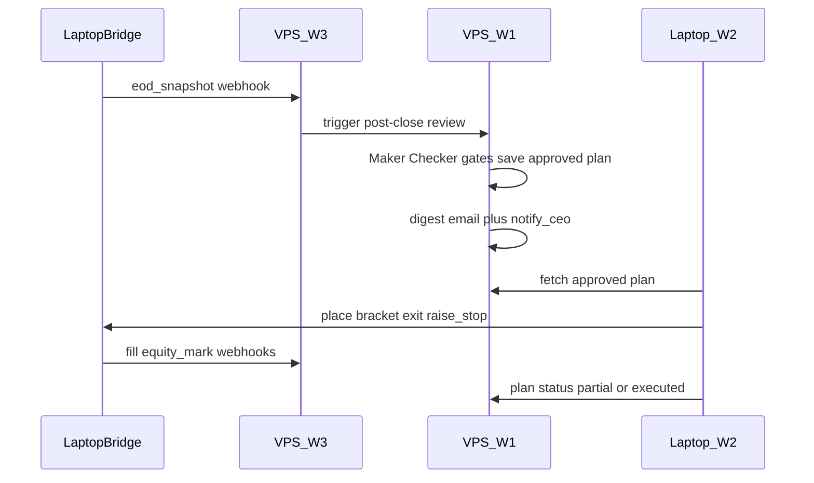

# IBKR Monthly Trading — Execution Model (Cloud vs Laptop)

When each workflow runs, what it does, and the expected outcome. **Quick tables (tools + schedules + outcomes):** [IBKR-MONTHLY-WORKFLOWS.md](IBKR-MONTHLY-WORKFLOWS.md). Related: [IBKR-MONTHLY-TRADING-PLAN.md](IBKR-MONTHLY-TRADING-PLAN.md), [IBKR-LOCAL-BRIDGE.md](IBKR-LOCAL-BRIDGE.md), [IBKR-MONTHLY-MAKER-PROMPT.md](IBKR-MONTHLY-MAKER-PROMPT.md), [IBKR-MONTHLY-CHECKER-PROMPT.md](IBKR-MONTHLY-CHECKER-PROMPT.md).

**Disclaimer:** Automation tooling — not financial advice. Paper-trade until validated.

---

## Cloud / VPS workflows

| Workflow | ID | When it runs | What it does | Expected outcome |
|----------|----|--------------|--------------|------------------|
| **W1 Post-Close Review & Plan** | `monthly-trading-w1-post-close` | After US close: (1) W3 receives `eod_snapshot` webhook from laptop, or (2) schedule fallback cron (`cron_post_close_fallback`, default ~21:05 Mon–Fri server local time), or (3) chat phrase `run monthly trading review` | Market regime, guardrail, screener, reconcile **prior open/partial plans**, Maker (Claude Opus) + Checker (deepseek-v4-flash), hard gates, optional CEO approval for discretionary loss sells ≥ threshold, save day plan, daily digest email + in-app notify | `trading_day_plans` row status **`approved`** (or pending CEO), digest email sent, CEO notified; plan ready for W2 |
| **W3 Event Handler** | `monthly-trading-w3-events` | Anytime laptop bridge POSTs webhook (`fill`, `reject`, `stop_out`, `equity_mark`, `eod_snapshot`, `order_status`) | Persist equity marks / update plan execution hints / milestone `notify_ceo`; on `eod_snapshot` chain-trigger W1 | DB marks/journal updated; CEO bell on milestones; W1 started after EOD |
| **W5 Weekly Review** | `monthly-trading-w5-weekly` | Saturday cron (`cron_weekly_review`) | Journal stats, watchlist hygiene notes, email; first week of month adds monthly metrics | Weekly (and monthly) email summary; no orders |

VPS does **not** talk to IB Gateway. It plans, gates, notifies, and stores state.

---

## Laptop workflows / processes

| Workflow / process | ID / name | When it runs | What it does | Expected outcome |
|--------------------|-----------|--------------|--------------|------------------|
| **Local IBKR Bridge** | `backend/local-ibkr-bridge` | At logon / always-on (Task Scheduler) while Gateway is up | HTTP on `127.0.0.1:3010`; snapshot/place/cancel; push fills & equity & EOD to VPS webhook | Gateway reachable; events reach W3 |
| **W2 Execution** | `monthly-trading-w2-execute` | US market open (Task Scheduler / `Run-Workflow.ps1` desktop package) | Fetch **approved/partial** plan from VPS; call local bridge to place brackets, exits, stop raises; report `executing` → `partial` / `executed` / `failed` back to VPS | Orders at IBKR; VPS plan status updated; optional notify |

W2 must **not** include `ceo_approval`, `brain`, or `agent` nodes (unsupported in desktop packages).

---

## Day-plan status lifecycle

| Status | Meaning |
|--------|---------|
| `pending` | Maker produced; gates/CEO not finished |
| `approved` | Ready for W2 |
| `executing` | W2 started |
| `partial` | Some actions done; remainder still owed |
| `executed` | All actionable legs done (or intentionally skipped with reason) |
| `failed` | W2/bridge reported failure |
| `superseded` | Newer W1 replaced this plan |

---

## Exception: laptop cannot update VPS (offline / webhook fail / partial)

| Situation | What VPS does on **next W1** run | Maker must |
|-----------|----------------------------------|------------|
| Plan **approved**, never executed (no fills, no status bump) | Still sees open plan via `listOpenPlans` | Reconcile vs IBKR snapshot; **carry forward** unfilled legs **or** `supersede` if regime/guardrail changed; **never double-buy** |
| Plan **partial** (some fills, VPS got some/none) | Open `partial` plan + live positions | Only schedule **remaining** actions; treat positions already held as done |
| Fills happened but webhook never reached VPS | Plan still `approved`/`executing` but snapshot shows new positions | **IBKR truth wins**; mark legs done in `prior_plan_reconcile`; suggest `partial`/`executed` |
| Bridge/Gateway down at open | W2 fails or does not run; plan stays `approved`/`failed` | Next W1: risk-off bias if repeated failure; carry exits/stop raises first; note CEO alert in digest |
| VPS unreachable from laptop mid-day | Bridge queues webhook retries; plan update may lag | Next successful webhook or next W1 snapshot reconcile repairs state |

**Invariant:** Never average down. Never invent fills. Prefer cash/reduce when sync is uncertain and monthly guardrail is stressed.

---

## Sequence (happy path)

