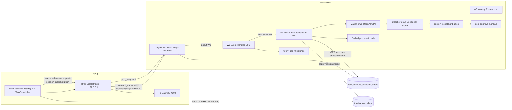

# IBKR Monthly Positive Return Trading System — Implementation Plan

Event-driven, split-architecture trading system: the VPS runs screening, Maker (OpenAI GPT) / Checker (DeepSeek cloud) planning, CEO approval, notifications, and the daily digest email; the laptop runs a small execution workflow plus a local IBKR bridge that places orders against the local IB Gateway and **polls** the book (no live fill stream), then POSTs snapshots/fills to the VPS ingest API (`/api/ibkr-trading/local-bridge-webhook`, W3 hook secret). The W3 **workflow** runs on **EOD** by default (then starts W1).

**CEO-facing flow diagrams + “data is per-user”:** [platform-help/20-ibkr-monthly-trading.md](platform-help/20-ibkr-monthly-trading.md).

**Owner isolation:** every cloud IBKR row (plans, snapshot cache, fills, equity marks, ledger, order events) is keyed by `owner_user_id` for that CEO — never a shared multi-tenant book.

### Workflow short definitions

| | Name | Goal | Outcome |
|---|------|------|---------|
| **W1** | Post-Close Review & Plan (`monthly-trading-w1-post-close`) | Plan **next** session (Maker/Checker + gates + optional CEO) | Approved/pending day plan + digest |
| **W2** | Execute (`monthly-trading-w2-execute`) | Place open plan on **laptop** via bridge | Orders at IBKR + plan status / execution report |
| **W3** | IBKR Events (`monthly-trading-w3-events`) | EOD event graph (journal/notify/start W1). Ingest URL uses this workflow’s **hook secret** | Owner book already cached by ingest; EOD starts W1 |
| **W4** | — | Not used in this suite | — |
| **W5** | Weekly Review (`monthly-trading-w5-weekly`) | Weekly performance email | Digest only (no trades) |

Full tables: [IBKR-MONTHLY-WORKFLOWS.md](IBKR-MONTHLY-WORKFLOWS.md). CEO language: [platform-help/20-ibkr-monthly-trading.md](platform-help/20-ibkr-monthly-trading.md) (includes IBKR Summary UI and transactional clear).

Related: [IBKR-TRADING-WORKFLOW.md](IBKR-TRADING-WORKFLOW.md), [IBKR-MONTHLY-WORKFLOWS.md](IBKR-MONTHLY-WORKFLOWS.md), [IBKR-MONTHLY-EXECUTION-MODEL.md](IBKR-MONTHLY-EXECUTION-MODEL.md), [IBKR-MONTHLY-MAKER-PROMPT.md](IBKR-MONTHLY-MAKER-PROMPT.md), [IBKR-MONTHLY-CHECKER-PROMPT.md](IBKR-MONTHLY-CHECKER-PROMPT.md), [IBKR-LOCAL-BRIDGE.md](IBKR-LOCAL-BRIDGE.md).

## Decisions locked in

- Paper account first (gateway port 4002); live promotion only after a validation period (`IBKR_ALLOW_LIVE` stays off).
- Split architecture: VPS = brains/approvals/notifications/email; laptop = order execution against local gateway via a new HTTP bridge; chained by webhooks.
- Market data: external API for screening/fundamentals (Financial Modeling Prep, BYO key), IBKR for account/orders/fills.
- Autonomy: buys and profitable sells automatic; exchange-side bracket stops automatic; CEO Kanban approval only for discretionary sells at >= 3% loss.
- Trading Maker = OpenAI GPT (`openai` Brain, default `gpt-4o`, vault **`openAI_key`**), trading Checker = DeepSeek cloud (`deepseek` Brain, default `deepseek-chat`, vault **`deepseek_key`**). Optional Brave Search MCP (`mcp-brave-search` + vault **`BRAVE_SEARCH_BYOK`**). No Ollama on W1 brains.
- All strategy parameters (mcap floor, momentum windows, risk %, monthly drawdown guardrail 3-5%, etc.) live in workflow variables / DB — nothing hardcoded.

## Architecture

## Phase 1 — VPS foundation (new backend code)

1. **Market data service + content tools** — new `backend/src/services/market-data.js` + `backend/src/routes/market-data.js` (owner-entitled like `ibkr-trading.js`), seeded into `content_tools_meta`:
   - `market_regime` — broader index vs 200-DMA -> risk_on/risk_off. Body `indexSymbol` (or comma-separated / `indexSymbols[]`); W1 uses `{{var.index_symbol}}`. Invalid/templates never hit FMP; 402 tickers are skipped; then `MARKET_DATA_REGIME_FALLBACK_SYMBOLS`.
   - `market_screener` — mcap > $50B, liquidity, momentum 3m/6m, above 50/200-DMA, within 15% of 52-wk high, volume; returns ranked candidates.
   - `market_history` — daily bars for DMA/momentum/volume-ratio calcs.
   - `market_fundamentals` — earnings/revenue growth.
   - Provider = FMP with `MARKET_DATA_API_KEY` (BYO key); provider abstraction + response caching to stay inside free-tier limits. Redacted logging.
2. **Portfolio state + guardrail** — new tables in `backend/src/db/schema.js`:
   - `ibkr_equity_marks` (owner, date, equity, cash, month_key, month_hwm) and tool `ibkr_monthly_guardrail` -> `{ mtd_return_pct, drawdown_from_hwm_pct, guardrail_breached, risk_mode }`.
   - `trading_day_plans` (owner, date, status pending/approved/executed, plan_json, checker_verdict, approvals) + endpoints `POST/GET /api/ibkr-trading/day-plan` and tools `trading_plan_save` / `trading_plan_fetch`.
   - Trade journal: extend `ibkr_order_events.detail_json` usage with entry/exit reasons; add `trading_journal` view tool for weekly stats (win rate, profit factor, avg win/loss, max DD, holding period).
3. **Seed strategy variables** — script like `backend/scripts/ibkr-seed-variables.js`: universe/momentum/entry thresholds, risk_per_trade 0.5-1%, position 3-8% (max 15%), partial-profit band 15-25%, cash band 30-80%, monthly target 3-5%, `monthly_drawdown_stop_pct` default 4, borderline bands, schedule crons.

## Phase 2 — Laptop IBKR bridge

4. **New `backend/local-ibkr-bridge/`** — slim Node service reusing `backend/src/services/ibkr-gateway-client.js` logic, loopback HTTP (e.g. 127.0.0.1:3010, local token auth):
   - Endpoints: `/ping`, `/account-snapshot`, `/place-bracket` (STP-LMT breakout entries + TP + stop), `/modify-stop` (trailing raise), `/sell-to-close`, `/cancel`, `/open-orders`, `/push-equity-mark`, `/push-eod-snapshot`.
   - Event pusher: order-status / equity / **account_snapshot** / EOD envelopes → HTTPS POST to VPS **ingest** URL `/api/ibkr-trading/local-bridge-webhook` with `x-workflow-hook-secret` = **W3 hook secret** (retry queue `data/webhook-retry.json`). Default zip prefills this URL — **not** the W3 workflow hook. Full book is pushed after every successful Gateway session (including end of execute-day-plan when orders fail). Intraday POSTs save cache/order events **without** starting W3. Post-close `eod_snapshot` **does** start W3, which starts W1; W1 reads VPS cache via `GET /api/ibkr-trading/account-snapshot/latest`. Equity timer `EQUITY_MARK_INTERVAL_SEC` default **300**. Optional: point `WEBHOOK_URL` at `/api/agent-workflows/hooks/monthly-trading-w3-events` to run the full W3 graph on every event.
   - Windows setup: `scripts/run-bridge.ps1` + `scripts/register-task-scheduler.ps1` (pattern from `platform-help/17-desktop-windows-download.md`).
   - Docs: [IBKR-LOCAL-BRIDGE.md](IBKR-LOCAL-BRIDGE.md) and `backend/local-ibkr-bridge/README.md`. Offline: `npm run test:offline` (`BRIDGE_MOCK_IBKR=1`).

## Where the Maker gets the strategy (goals and objectives)

- **Canonical strategy prompt module** — the full "Monthly Positive Return Trading System" goal (universe, market filter, selection, entry, sizing, stops, profit/cash management, discipline rules, monthly drawdown guardrail; see Appendix) is captured verbatim in `backend/scripts/lib/trading-strategy-prompt.js`, versioned in git. The W1 seed script installs it as the **Maker Brain node's `systemPrompt`** in the workflow definition.
- **Numbers are variables, not prose** — every threshold in the prompt references workflow variables (e.g. "risk no more than `{{var.risk_per_trade_pct}}`% per trade"), so behavior is tunable from the Variables panel without re-seeding or editing the prompt.
- **Per-run facts as node inputs** — Maker receives live data wired from upstream nodes each run: market regime, current positions/cash (laptop snapshot), screener candidates with technicals + fundamentals, guardrail status, and past-trade learnings (`ibkr_order_learnings` + journal stats) so monthly statistics feed back into decisions.
- **Checker gets an independent checklist rendering** of the same rules to audit the Maker's plan; the `custom_script` hard gates enforce the non-negotiables in deterministic code so an out-of-policy trade cannot pass even if both LLMs err.
- **Certify goal is separate** — the WorkflowGoal for certification describes pipeline success criteria (plan produced, gates pass, digest sent), not trading rules.

## EXECUTION RECOVERY / LAPTOP<->VPS SYNC

Day-plan statuses: `pending | approved | executing | partial | executed | failed | superseded`.

Open plans for recovery/W2: `approved | executing | partial | failed` (`listOpenPlans`).

W2 reports progress via `markPlanExecution` (merges `execution_report` into `plan_json.execution`).

Maker (W1) must each run:
1. Load prior open day plan(s) + live IBKR snapshot (or last equity mark).
2. Reconcile intents vs reality; **IBKR truth wins** over VPS plan status.
3. If prior plan **approved but not executed** (laptop offline): do not duplicate — (a) carry forward unfilled legs with `carry_forward: true`, or (b) mark superseded and rebuild if regime/guardrail changed.
4. If **partial**: only remaining undone actions; never re-buy filled adds; never average down.
5. If VPS missed fill webhooks: positions in snapshot = done; note `suggested_status: partial|executed`.
6. If laptop repeatedly fails: reduce new entries, prefer risk-reducing exits, alert CEO via digest notes.
7. Always emit `prior_plan_reconcile` in Maker JSON.

Keep in sync with `backend/scripts/lib/trading-strategy-prompt.js`.

## Phase 3 — Workflows (seeded like `backend/scripts/seed-ibkr-maker-checker-workflow.js`)

5. **W1 Post-Close Review & Plan (VPS, event-triggered by EOD snapshot webhook; cron fallback)** — `market_regime` -> guardrail check -> position review (50/200-DMA, momentum, abnormal volume) -> `market_screener` + fundamentals -> **Maker Brain (OpenAI GPT via vault openAI_key; optional Brave MCP)** produces plan JSON (holds/reduces/exits/stop-raises/partial-profits/new breakout entries with trigger levels and 1.5x volume condition) -> **Checker Brain (DeepSeek cloud via vault deepseek_key)** validates against rules -> `custom_script` deterministic gates (risk %, exposure caps, market filter, guardrail, never-average-down) -> IF plan contains discretionary sells at >= 3% loss -> `ceo_approval` Kanban gate for those items only -> save to `trading_day_plans` -> **daily consolidated digest email** (equity, MTD return vs target, fills today, plan for tomorrow, guardrail status) + `notify_ceo` summary.
6. **W2 Execution (laptop desktop package, Task Scheduler at US market open)** — fetch approved plan (remote tool node) -> local API nodes to bridge: place bracket entries, apply stop raises, execute exits/partial profits -> report results (remote tool nodes `ibkr_confirm_fill` / plan status update). No ceo_approval/brain nodes locally (desktop-runner constraint).
7. **W3 IBKR Event Handler (VPS)** — default trigger is **`eod_snapshot`** fan-out from the ingest API (or `fanout_w3=1` / direct W3 hook). Graph: journal + `notify_ceo` on milestones; recompute guardrail; chain-trigger W1. Intraday fills/snapshots persist on ingest **without** this run.
8. **W5 Weekly Review (VPS, cron Saturday)** — prune weak watchlist names, promote candidates, performance stats email; monthly section (metrics, HWM reset note) on the first weekly run of each month.

## Phase 4 — Certify, validate, deploy

See runbook: [IBKR-MONTHLY-PHASE4.md](IBKR-MONTHLY-PHASE4.md).

9. **Certify + paper E2E (automated)**
   - Set certify env (`WORKFLOW_CERTIFY_MAKER_MODEL` = `gpt-4o`, `WORKFLOW_CERTIFY_CHECKER_MODEL` = `deepseek-chat`). Comments in `.env.example` + `deploy/scripts/ensure-workflow-certify-env.sh`.
   - Seed W1: Maker vault `openAI_key`, Checker vault `deepseek_key`, optional Brave `BRAVE_SEARCH_BYOK` MCP.
   - Helper: `node backend/scripts/certify-monthly-trading-workflows.js` (`--dry-run` / `--seed` / `--poll`). Starts `agent_workflow_certify_start` for **W1 / W3 / W5 only** (not W2 laptop package).
   - Paper E2E: `node backend/scripts/test-monthly-trading-paper-e2e.js` (pattern from `test-ibkr-maker-checker-e2e.js`) — screener/regime → plan → gates → CEO loss-sell branch → plan fetch → dry-run place (ledger + `BRIDGE_MOCK_IBKR`) → W3 webhook fill smoke → digest/journal compose. Passes without live Gateway when paper bridge mock is on.
10. **Deploy + multi-week paper validation (CEO / ops)**
   - Deploy local + VPS; laptop Task Scheduler via `backend/local-ibkr-bridge/scripts/register-task-scheduler.ps1` ([IBKR-LOCAL-BRIDGE.md](IBKR-LOCAL-BRIDGE.md)).
   - **Automated:** seeds, paper E2E, certify helper, env docs.
   - **Not automated (CEO):** multi-week paper account validation (digests, fills, guardrail behaviour, Kanban loss sells) before flipping `IBKR_TRADING_ENABLED` / live ports (`IBKR_ALLOW_LIVE` stays off until explicitly approved).

## Open items (CEO-provided during implementation)

- FMP (or preferred provider) API key; CEO vault **openAI_key** + **deepseek_key** for W1 brains (optional **BRAVE_SEARCH_BYOK**); confirmation of SMTP configured (`WORKFLOW_SMTP_*`) and digest recipient address.

## Appendix — Strategy goal (verbatim source for the Maker system prompt)

### Monthly Positive Return Trading System

**Objective:** Generate consistent monthly gains while protecting capital. Success is measured by the combined value of cash and open positions at month end.

**Universe**
- US market. Trade only highly liquid stocks with market capitalisation above US$50 billion.
- Focus on approximately 50-100 stocks with the strongest relative strength and liquidity.
- Avoid low-volume or highly speculative stocks.

**Market Filter**
- Only take new long positions when the broader market index is above its 200-day moving average.
- When the market is below its 200-day moving average: reduce exposure, increase cash, take only exceptional high-conviction setups.

**Stock Selection** — select stocks satisfying:
- Strong 3-month and 6-month momentum.
- Above 50-day and 200-day moving averages.
- Within 15% of their 52-week high.
- Strong earnings and revenue growth.
- High trading volume.

**Entry Rules** — enter only when:
- The stock breaks above a well-defined resistance or consolidation.
- Volume is at least 1.5x the recent average.
- Relative strength is improving.
- Build positions gradually rather than buying the full allocation immediately.

**Position Sizing**
- Risk no more than 0.5-1% of total portfolio value on any single trade.
- Initial allocation per position should typically be 3-8% of the portfolio.
- Maximum exposure to any single stock should not exceed 15%.

**Stop Loss**
- Every position must have a predefined stop.
- Exit immediately if the stop is triggered.
- Never average down losing trades.

**Profit Management**
- Allow winners to run while trailing the stop.
- Consider taking partial profits after gains of around 15-25%.
- Let the remaining position follow the trend.

**Cash Management**
- Cash is a position. Increase cash during weak markets.
- It is acceptable to hold 30-80% cash when opportunities are limited.

**Daily Review** (every trading day after close)
- Existing positions: price vs 50-DMA and 200-DMA, stop triggered, momentum weakened, abnormal selling volume -> decide hold / reduce / exit / raise trailing stop.
- Watchlist: scan for new breakouts, tight consolidations, strong relative strength, high volume; rank candidates for the next session.
- Risk: total exposure, cash %, largest position, open risk if all stops hit; reduce exposure if portfolio risk exceeds predefined limits.

**Weekly Review**
- Remove weak stocks, promote stronger candidates from the watchlist, rebalance only if a materially better opportunity exists.

**Monthly Objective**
- Focus on preserving gains rather than maximising returns.
- If the portfolio achieves the monthly target (for example 3-5%), reduce risk rather than chasing additional returns.
- Avoid forcing trades late in the month.

**Monthly Risk Rule (drawdown guardrail)**
- If the portfolio falls more than 3-5% from its highest value during the current month, stop opening new positions and reduce exposure. Resume normal trading only after the portfolio recovers or at the start of the next month.

**Discipline Rules**
- Never trade based on news headlines or emotions. Never revenge trade after losses.
- Record every trade with entry reason, exit reason, what went well, what should improve.
- Review statistics monthly to improve execution.

**Performance Metrics** — monthly return (%), win rate, average winner vs average loser, profit factor, maximum drawdown, cash allocation, percentage of winning months, average holding period, largest losing streak.
