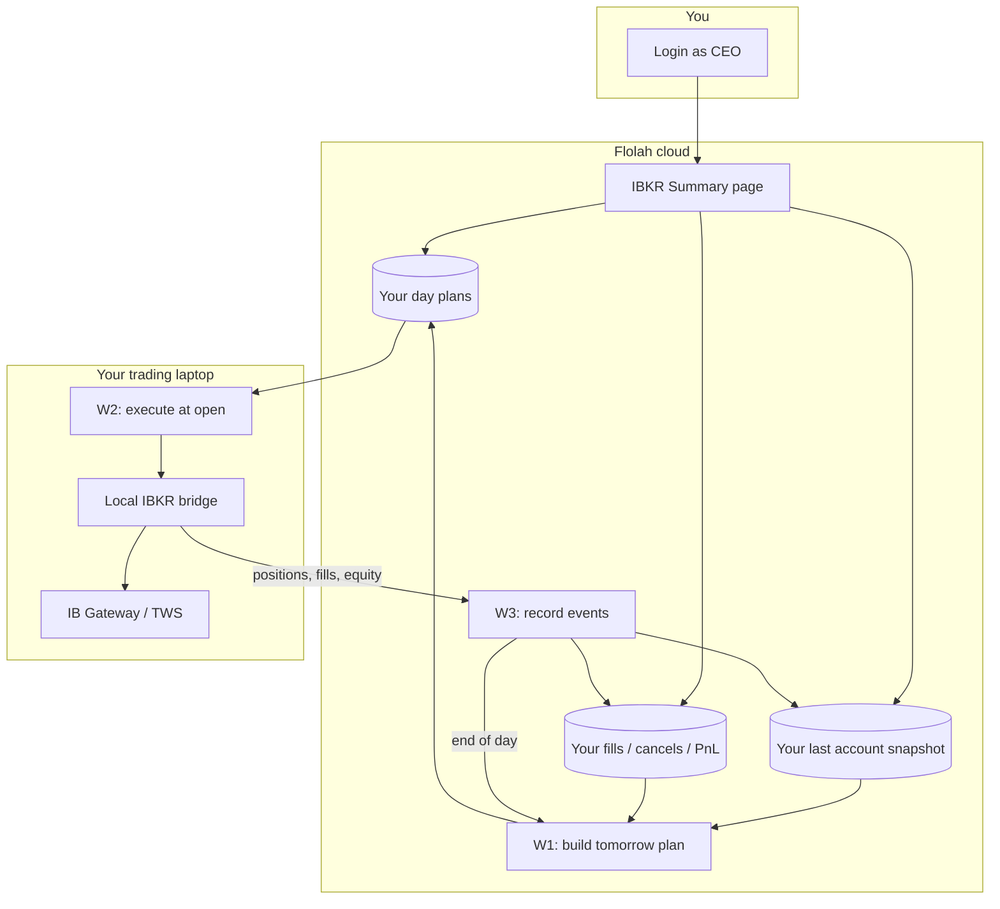
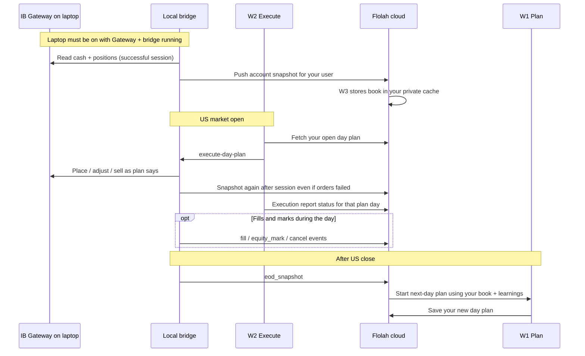
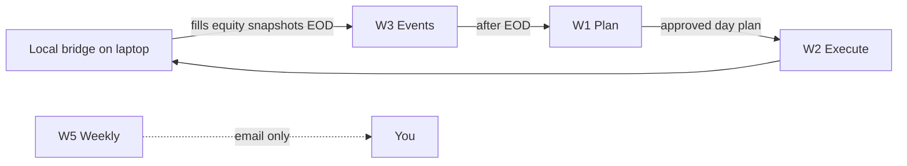

# IBKR Monthly Positive Return trading (CEO)

Automate post-close **planning on Flolah (cloud)** and **order placement on your laptop** (IB Gateway + local bridge). Paper accounts first.

**Not financial advice.** Validate for weeks on paper before enabling live trading.

---

## Privacy: is IBKR data shared with other users?

**No.** Trading data is **per CEO account** (owner-scoped). It is not a shared pool across Flolah users.

| What | Isolation |
|------|-----------|
| Day plans, execution reports | Your `owner_user_id` only |
| Positions / cash snapshot pushed from laptop | Your cache only |
| Fills, order events, cancel learnings | Your rows only |
| Equity marks & monthly drawdown guardrail | Your marks only |
| Budget / day ledger | Your ledger only |
| IBKR Summary page | Yours only (after login) |
| Local bridge token + your IBKR account | Live on **your laptop**; never exposed to another CEO |

APIs resolve the owner from **your session** (or the workflow/desktop token that acts as you). Another user cannot set `owner_user_id` in a request body to read or change your book. Leaving the platform deletes your IBKR rows with offboarding.

---

## Big picture (end-to-end)

Flolah **plans** and **records**. Your **laptop** talks to Interactive Brokers and reports back.

Plain language:

1. **Evening (cloud):** W1 looks at the market, **your** last IBKR positions, and past learnings → proposes a day plan (Maker + Checker).
2. **You approve** what needs CEO approval (e.g. discretionary loss sells).
3. **Next open (laptop):** W2 downloads **your** approved plan → local bridge → IB Gateway places orders.
4. **All day (laptop → cloud):** bridge sends fills and fresh account snapshots to W3 for **your** account only.
5. **Anytime:** IBKR Summary shows plan vs execution and portfolio for **you**.

---

## Daily lifecycle

### What “successful session” means

If the bridge **connected to IBKR and read** cash/positions, that book is pushed—even when:

- an order was rejected  
- there was not enough cash  
- placement was dry-run (`IBKR_TRADING_ENABLED` off)  

Orders can fail; the **snapshot still updates** so the next plan uses real broker state.

---

## Workflows (names, goals, outcomes)

The monthly suite uses **W1, W2, W3, and W5**. There is **no W4** in this product (numbering stays W1–W3 then W5 so docs match workflow IDs and older plan notes).

| ID | Name in UI / system | Where it runs | Goal (purpose) | Expected outcome |
|----|---------------------|---------------|----------------|------------------|
| **W1** | **Post-Close Review & Plan** · id `monthly-trading-w1-post-close` | **Cloud (VPS)** | After the market day, review regime, your positions, learnings, and screener → Maker builds a plan → Checker + hard gates validate → optional CEO approval on loss sells → save the next trading-day plan | Your **day plan** is stored (`approved` or waiting CEO); you get a **digest / notify**; plan is ready for W2 |
| **W2** | **Execute** · id `monthly-trading-w2-execute` | **Your laptop** (desktop package) | At US open (or when you run it), fetch **your** open/approved plan and send actions to the local IBKR bridge | IB Gateway receives place / stop / sell instructions; plan status becomes **`executing` → `partial` / `executed` / `failed`** with an execution report |
| **W3** | **IBKR Events** · id `monthly-trading-w3-events` | **Cloud (VPS)** webhook | Receive events from the local bridge all day: account snapshots, equity marks, fills, cancels, rejects, EOD | **Your** book cache, equity/HWM, order learnings, and journal stay updated; milestones can **notify you**; **EOD** starts **W1** for the next plan |
| **W4** | — | — | **Not used** in the Monthly Positive Return suite (no workflow id) | — |
| **W5** | **Weekly Review** · id `monthly-trading-w5-weekly` | **Cloud (VPS)** | Once a week (default Saturday), summarize performance and guardrail for review | **Email digest only** — does **not** place orders |
| **Bridge** | Local IBKR bridge (Connectors download) | **Your laptop** | Always-on adapter: Gateway on loopback + push webhooks to W3 | Cloud always has **your** latest session book/fills when Gateway + `WEBHOOK_URL` work |

### When each runs

| ID | Typical trigger |
|----|-----------------|
| **W1** | Bridge **EOD snapshot** (via W3); schedule fallback after US close; chat phrase `run monthly trading review`; manual run |
| **W2** | Windows Task Scheduler / desktop **Run-Workflow** around US open; manual |
| **W3** | Anytime the bridge POSTs to the W3 **webhook** (also manual test) |
| **W5** | Saturday cron (variable `cron_weekly_review`, default morning); manual |

### How they chain

Day-plan statuses W1/W2 use: `pending` → `approved` → `executing` → `partial` / `executed` / `failed` (or `superseded` by a newer W1).

Full ops tables (tools, crons): [IBKR-MONTHLY-WORKFLOWS.md](../IBKR-MONTHLY-WORKFLOWS.md). Recovery: [IBKR-MONTHLY-EXECUTION-MODEL.md](../IBKR-MONTHLY-EXECUTION-MODEL.md).

---

## Budget & risk (W1 Variables)

Open **Workflows → monthly-trading-w1-post-close → Variables**:

| Variable | Meaning |
|----------|---------|
| `daily_budget_usd` | Max **USD notional for new buys** (`new_entry`) in a plan |
| `max_trades_per_day` | Max new buy count |
| `risk_per_trade_pct` / `position_size_pct_*` | Risk and size % caps |
| `cash_band_pct_*` | Target cash band |
| `monthly_drawdown_stop_pct` | Halt new entries after drawdown from **your** month high-water mark |

Budget applies to **buys only**, not sells. Prefer an IBKR **Cash** account so the broker itself blocks margin borrowing.

---

## Connectors → Download local IBKR bridge

1. **Connectors** → **Download local IBKR bridge** (or lite without Node).
2. Unzip; keep minted `LOCAL_BRIDGE_TOKEN` private.
3. Paste the same token into W2 variable `local_bridge_token`.
4. Set `WEBHOOK_URL` to your W3 hook (so **snapshots and fills** reach **your** cloud account); optional `WEBHOOK_SECRET`.
5. Run IB Gateway (paper **4002**) → `npm install` → `.\scripts\run-bridge.ps1`.

Details: [IBKR-LOCAL-BRIDGE.md](../IBKR-LOCAL-BRIDGE.md). Desktop W2 package: [17-desktop-windows-download.md](./17-desktop-windows-download.md).

---

## Learnings & snapshot feed

| Path | Why it matters |
|------|----------------|
| Bridge **account_snapshot** (after any good Gateway read) | Updates **your** last positions/cash for W1 / Summary |
| Bridge fill / cancel / reject | **Your** order learnings for the Maker |
| W2 execution report | Plan day status (`executed` / `partial` / `failed`) for plan-vs-done |
| Equity marks (~every 5 min if configured) | **Your** equity + monthly guardrail |

W1 reads **your last laptop snapshot** (`account-snapshot/latest`), not a live Gateway on the cloud server.

---

## IBKR Summary page (`/ibkr-summary`)

Open **IBKR Summary** in the left nav (Prebuilt Workflows) after you are signed in.

### What you see

| Area | Purpose |
|------|---------|
| Metrics strip | Day budget remaining, realized/unrealized PnL, open plans, paper/live mode |
| **Positions** card | Stocks/cash book from **your** last laptop snapshot (or optional live Gateway if co-located) |
| **Day-wise planned vs executed** card | One row per plan day — status, mappable legs, order ids, gap notes |
| **Drilldown** card (when you click a day) | Planned actions, bridge mapping, execution report, order events, fills |

Each card scrolls **independently** with a thin scrollbar so the page does not run on forever.

### Clear transactional data

Use **Clear data…** when you want a clean paper trial without re-seeding strategy knobs.

| Cleared (your owner only) | Kept |
|---------------------------|------|
| Day plans + execution reports | Workflow **Variables** (`daily_budget_usd`, allowlist, risk %, crons, …) |
| Order events, fills, journal lots | Workflow graph definitions (W1–W5) |
| Equity marks, snapshot cache, cash events | Tools meta / tool grants |
| Trade reservations, day **spend** ledger, position hold meta | Vault / BYOK keys |

Type the exact phrase `CLEAR_IBKR_TRANSACTIONAL` to enable the button.

API (session-authenticated CEO):

| Method | Path | Role |
|--------|------|------|
| `GET` | `/api/ibkr-trading/summary` | Dashboard payload |
| `GET` | `/api/ibkr-trading/summary/day?plan_date=YYYY-MM-DD` | Day drilldown |
| `GET` | `/api/ibkr-trading/summary/clear-transactional` | Preview row counts |
| `POST` | `/api/ibkr-trading/summary/clear-transactional` | Body `{ "confirm": "CLEAR_IBKR_TRANSACTIONAL" }` |

Service implementation: `backend/src/services/ibkr-transactional-clear.js`.

---

## Chat / certify

- Chat phrase (W1): `run monthly trading review`
- Publish W1 only after vault keys **openAI_key** (Maker) + **deepseek_key** (Checker) are set under Management → API Keys
- Optional: vault **BRAVE_SEARCH_BYOK** for Maker/Checker Brave Search MCP
- Phase 4 runbook: [IBKR-MONTHLY-PHASE4.md](../IBKR-MONTHLY-PHASE4.md)

---

## Ask Platform Help

Examples:

- “Is my IBKR data shared with other companies?”
- “What does W1 / W2 / W3 / W5 do?”
- “Is there a W4?”
- “How do I clear IBKR summary history?”
- “How do I download the IBKR bridge?”
- “Where is daily_budget_usd?”
- “How does the cloud know my positions?”
- “What does W3 do with cancels?”
