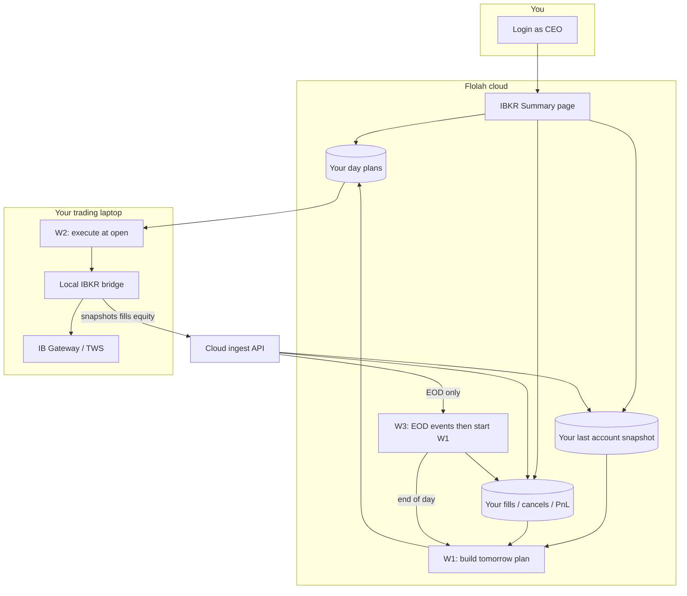
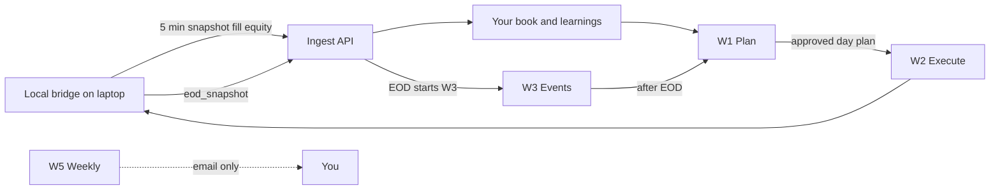

# IBKR Monthly Positive Return trading (CEO)

Automate post-close **planning on Flolah (cloud)** and **order placement on your laptop** (IB Gateway + local bridge). Paper accounts first.

**Not financial advice.** Validate for weeks on paper before enabling live trading.

---

## Privacy: is IBKR data shared with other users?

**No.** Trading data is **per CEO account** (owner-scoped). It is not a shared pool across Flolah users.

| What | Isolation |
|------|-----------|
| Day plans, execution reports | Your `owner_user_id` only |
| Positions / cash snapshot pushed from laptop | Your cache only |
| Fills, order events, cancel learnings | Your rows only |
| Equity marks & monthly drawdown guardrail | Your marks only |
| Budget / day ledger | Your ledger only |
| IBKR Summary page | Yours only (after login) |
| Local bridge token + your IBKR account | Live on **your laptop**; never exposed to another CEO |

APIs resolve the owner from **your session** (or the workflow/desktop token that acts as you). Another user cannot set `owner_user_id` in a request body to read or change your book. Leaving the platform deletes your IBKR rows with offboarding.

---

## Big picture (end-to-end)

Flolah **plans** and **records**. Your **laptop** talks to Interactive Brokers and reports back.



Plain language:

1. **Evening (cloud):** W1 looks at the market, **your** last IBKR positions, and past learnings → Maker proposes a day plan → Checker reviews. If Checker rejects, Maker runs again (up to 3 times) with Checker notes **and** the previous plan JSON, and must output a full replacement JSON plan.
2. **You approve** what needs CEO approval (e.g. discretionary loss sells).
3. **Next open (laptop):** W2 downloads **your** approved plan → local bridge → IB Gateway places orders.
4. **All day (laptop → cloud):** the bridge **polls** Gateway (default every **5 minutes**) and after W2/place, then POSTs snapshots/fills to Flolah for **your** account. That updates Summary/W1 cache. It does **not** start a W3 workflow run on every tick.
5. **After US close:** `eod_snapshot` **does** run **W3**, which starts **W1** for tomorrow.
6. **Anytime:** IBKR Summary shows plan vs execution and portfolio for **you**.

---

## Daily lifecycle

```mermaid
sequenceDiagram
  participant GW as IB Gateway on laptop
  participant Bridge as Local bridge
  participant W2 as W2 Execute
  participant Cloud as Flolah cloud
  participant W1 as W1 Plan

  Note over Bridge,GW: Laptop must be on with Gateway + bridge running
  Bridge->>GW: Read cash + positions (successful session)
  Bridge->>Cloud: POST account snapshot (ingest API + W3 secret)
  Cloud->>Cloud: Store book in your private cache (W3 workflow does not run)

  Note over W2,Bridge: US market open
  W2->>Cloud: Fetch your open day plan
  W2->>Bridge: execute-day-plan
  Bridge->>GW: Place / adjust / sell as plan says
  Bridge->>Cloud: Snapshot again after session even if orders failed
  W2->>Cloud: Execution report status for that plan day

  opt Fills and marks during the day
    Bridge->>Cloud: fill / equity_mark / cancel (ingest only; W3 does not run)
  end

  Note over Bridge,W1: After US close
  Bridge->>Cloud: eod_snapshot
  Cloud->>Cloud: Ingest book, then start W3
  Cloud->>W1: W3 starts next-day plan using your book + learnings
  W1->>Cloud: Save your new day plan
```

### What “successful session” means

If the bridge **connected to IBKR and read** cash/positions, that book is pushed—even when:

- an order was rejected  
- there was not enough cash  
- placement was dry-run (`IBKR_TRADING_ENABLED` off)  

Orders can fail; the **snapshot still updates** so the next plan uses real broker state.

---

## Workflows (names, goals, outcomes)

The monthly suite uses **W1, W2, W3, and W5**. There is **no W4** in this product (numbering stays W1–W3 then W5 so docs match workflow IDs and older plan notes).

| ID | Name in UI / system | Where it runs | Goal (purpose) | Expected outcome |
|----|---------------------|---------------|----------------|------------------|
| **W1** | **Post-Close Review & Plan** · id `monthly-trading-w1-post-close` | **Cloud (VPS)** | After the market day, review regime, your positions, learnings, and screener → Maker builds a plan → Checker + hard gates validate → optional CEO approval on loss sells → save the next trading-day plan. Maker↔Checker may loop (default 3). Pass 2+ injects Checker adjustments **and** the previous Maker JSON; Maker must emit a full replacement plan JSON (not a prose reply). | Your **day plan** is stored (`approved` or waiting CEO); you get a **digest / notify**; plan is ready for W2 |
| **W2** | **Execute** · id `monthly-trading-w2-execute` | **Your laptop** (desktop package) | At US open (or when you run it), fetch **your** open/approved plan and send actions to the local IBKR bridge. Buys whose limit is far from the live last are **skipped** (not placed) | IB Gateway receives place / stop / sell instructions; plan status becomes **`executing` → `partial` / `executed` / `failed`** with an execution report |
| **W3** | **IBKR Events** · id `monthly-trading-w3-events` | **Cloud (VPS)** | Owns the **webhook secret** that binds the laptop to **you**. Runs the event graph for **EOD** (and optional `fanout_w3`): journal, `notify_ceo`, guardrail, **start W1**. Default 5‑minute snapshots and fills persist on the ingest API **without** starting this workflow | Book/order events already on disk from ingest; on EOD you get journal/notify + **W1 kicked off** |
| **W4** | — | — | **Not used** in the Monthly Positive Return suite (no workflow id) | — |
| **W5** | **Weekly Review** · id `monthly-trading-w5-weekly` | **Cloud (VPS)** | Once a week (default Saturday), summarize performance and guardrail for review | **Email digest only** — does **not** place orders |
| **Bridge** | Local IBKR bridge (Connectors download) | **Your laptop** | Always-on adapter: Gateway on loopback; **polls** (does not subscribe to a live IBKR fill stream); POSTs to the ingest URL with the W3 secret | Cloud always has **your** latest session book when Gateway + `WEBHOOK_URL` work |

### When each runs

| ID | Typical trigger |
|----|-----------------|
| **W1** | Bridge **EOD snapshot** (via W3); schedule fallback after US close; chat phrase `run monthly trading review`; manual run. Cron is **server timezone** (`TZ` in deploy `.env`, e.g. Asia/Singapore). Seed default `5 21 * * 1-5` is 21:05 *on the server clock* — on a Singapore VPS that is 09:05 US Eastern, not post-close. Convert US 16:10 Eastern to server local time (Singapore: `40 4 * * 2-6` = 04:40 Tue–Sat). |
| **W2** | Windows Task Scheduler / desktop **Run-Workflow** around US open (convert 09:30 America/New_York to laptop local); manual |
| **W3** | **`eod_snapshot`** from the bridge (default). Also manual **Run**, or `fanout_w3=1` on the ingest URL. Not every 5‑minute snapshot. Laptop: `scripts\push-eod-snapshot.ps1` after US close. |
| **W5** | Saturday cron (variable `cron_weekly_review`, default `0 10 * * 6` server local morning); manual |

### How they chain



### Ingest URL vs W3 run (default Connectors zip)

The laptop does **not** keep a standing IBKR event socket. It **reads Gateway** on a timer (`EQUITY_MARK_INTERVAL_SEC`, default **300** = 5 minutes) and around W2 / place / `/push-*`. Those POSTs go to:

`WEBHOOK_URL=https://<your-host>/api/ibkr-trading/local-bridge-webhook`

with header `x-workflow-hook-secret` = **your W3 workflow’s** hook secret (that is how the cloud knows the laptop is **you**). Settings → IP Whitelists (IBKR bridge) can further lock the laptop public IP.

| Bridge event | What the ingest API does | Does the **W3 workflow** run? |
|--------------|--------------------------|-------------------------------|
| `account_snapshot` / `equity_mark` (5‑min timer) | Saves **your** book + equity | **No** |
| `fill` / `reject` / `cancel` / `order_status` (after place, if classified) | Saves **your** order events (Summary drilldown) | **No** (unless `fanout_w3=1`) |
| `eod_snapshot` (`POST /push-eod-snapshot`) | Saves book, then **starts W3** | **Yes** — W3 then starts **W1** |

Point `WEBHOOK_URL` at `/api/agent-workflows/hooks/monthly-trading-w3-events` only if you want **every** event to run the full W3 graph (journal, notify, ingest nodes). That is slower; the ingest URL is the default so Summary/W1 stay fresh without a workflow run every 5 minutes.

Day-plan statuses W1/W2 use: `pending` → `approved` → `executing` → `partial` / `executed` / `failed` (or `superseded` by a newer W1).

Full ops tables (tools, crons): [IBKR-MONTHLY-WORKFLOWS.md](../IBKR-MONTHLY-WORKFLOWS.md). Recovery: [IBKR-MONTHLY-EXECUTION-MODEL.md](../IBKR-MONTHLY-EXECUTION-MODEL.md).

---

## Budget & risk (W1 Variables)

Open **Workflows → monthly-trading-w1-post-close → Variables**:

| Variable | Meaning |
|----------|---------|
| `daily_budget_usd` | Max **USD notional for new buys** (`new_entry`) in a plan |
| `max_trades_per_day` | Max new buy count |
| `risk_per_trade_pct` | Max **stop-loss % below entry per order** (default **5**). Leave blank or `0` so the Maker chooses the stop. Hard gates reject a `new_entry` whose stop is farther than this. |
| `position_size_pct_*` | Size % caps. New entries must use min(daily budget, cash, `position_size_pct_max` of equity) as fully as whole shares allow. |
| `cash_band_pct_*` | Target cash band |
| `monthly_drawdown_stop_pct` | Halt new entries after drawdown from **your** month high-water mark |
| `entry_slip_pct_max` / `entry_discount_pct_max` | BUY limit vs last: not more than 0.25% **above** / 3% **below** (default). Stops invented cheap limits that would never fill. Company setup from the Flolah demo pack installs the same W1 bindings. |
| `screener_enrich_limit` | Top N screener names get FMP PE / SMA / 3m–6m momentum / YoY (default 8). Missing fields → Maker may use Brave Search. |

Budget applies to **buys only**, not sells. Prefer an IBKR **Cash** account so the broker itself blocks margin borrowing.

**How to set the per-order stop cap:** on W1 Variables, set `risk_per_trade_pct` to a number (default **5** = stop at most 5% below entry). Clear the value (or set `0`) and **Publish** so the Maker picks the stop; hard gates will not cap distance.

Maker must **choose** on every `new_entry`:

- **Full bracket** (`bracket: true`): qty, entry, stop below, take-profit above. W2 places parent BUY + stop + TP.
- **Hold for weeks** (`bracket: false`, `exit_plan: later_day_plan`, `forecast_up_weeks` ≥ 1): omit take-profit when the name is predicted to grind higher over the next week or few weeks. A later day’s W1 plan decides hold / raise_stop / partial / sell. Keep a protective stop when a breakdown would invalidate the thesis. W2 places `stop_only` or `entry_only` — it does **not** skip a documented hold-for-weeks entry.

W1 screener rows include FMP **PE, SMA 50/200, 3m/6m momentum, 52-week distance, revenue/EPS YoY** on the top `screener_enrich_limit` names (default 8). If those fields are missing (402 / not enriched), Maker may use **Brave Search** as a fallback and must quote a snippet — it must not invent PE or trend. A `new_entry` with `tp_price: null` and **no** later-day-plan choice is still rejected. Paper fills are not required for a successful book — open working orders (including **PreSubmitted** on weekends) count.

---

## Connectors → Download local IBKR bridge

1. **Connectors** → **Download local IBKR bridge** (or lite without Node).
2. Unzip; keep minted `LOCAL_BRIDGE_TOKEN` private.
3. Paste the same token into W2 variable `local_bridge_token`.
4. Keep `WEBHOOK_URL` as **`/api/ibkr-trading/local-bridge-webhook`** (Connectors zip prefills this). Set `WEBHOOK_SECRET` to **your W3** event-hook secret (not a different CEO’s). Do **not** point at the W3 hook URL unless you want every 5‑minute tick to start a W3 run.
5. Run IB Gateway (paper **4002**) → `npm install` → `.\scripts\run-bridge.ps1`.

Details: [IBKR-LOCAL-BRIDGE.md](../IBKR-LOCAL-BRIDGE.md). Desktop W2 package: [17-desktop-windows-download.md](./17-desktop-windows-download.md).

---

## Learnings & snapshot feed

| Path | Why it matters |
|------|----------------|
| Bridge **account_snapshot** (after any good Gateway read) | Updates **your** last positions/cash for W1 / Summary |
| Bridge fill / cancel / reject | **Your** order learnings for the Maker |
| W2 execution report | Plan day status (`executed` / `partial` / `failed`) for plan-vs-done |
| Equity marks (~every 5 min if configured) | **Your** equity on the ingest API; monthly guardrail recompute is a **W3** step (EOD / fan-out), not every timer tick |

W1 reads **your last laptop snapshot** (`account-snapshot/latest`), not a live Gateway on the cloud server. A fill hours after place is picked up on the **next poll/snapshot**, not the instant IBKR fills.

---

## IBKR Summary page (`/ibkr-summary`)

Open **IBKR Summary** in the left nav (Prebuilt Workflows) after you are signed in.

### What you see

| Area | Purpose |
|------|---------|
| Metrics strip | Day budget remaining, realized/unrealized PnL, open plans, paper/live mode |
| **IBKR last known truth** (toolbar) | Readonly popup of the **last cached laptop/Gateway snapshot** (capture time, cash/equity, positions, open orders). Not a live cancel of IB orders; after **Clear data**, cache is empty until the bridge pushes again |
| **Positions** card | Stocks/cash book from **your** last laptop snapshot (or optional live Gateway if co-located) |
| **Day-wise planned vs executed** card | One row per plan day — status, mappable legs, order ids, gap notes |
| **Drilldown** card (when you click a day) | Planned actions, bridge mapping, execution report, order events, fills |

Each card scrolls **independently** with a thin scrollbar so the page does not run on forever.

### Clear transactional data

Use **Clear data…** when you want a clean paper trial without re-seeding strategy knobs.

| Cleared (your owner only) | Kept |
|---------------------------|------|
| Day plans + execution reports | Workflow **Variables** (`daily_budget_usd`, allowlist, risk %, crons, …) |
| Order events, fills, journal lots | Workflow graph definitions (W1–W5) |
| Equity marks, snapshot cache, cash events | Tools meta / tool grants |
| Trade reservations, day **spend** ledger, position hold meta | Vault / BYOK keys |

Type the exact phrase `CLEAR_IBKR_TRANSACTIONAL` to enable the button.

API (session-authenticated CEO):

| Method | Path | Role |
|--------|------|------|
| `GET` | `/api/ibkr-trading/summary` | Dashboard payload |
| `GET` | `/api/ibkr-trading/summary/day?plan_date=YYYY-MM-DD` | Day drilldown |
| `GET` | `/api/ibkr-trading/summary/clear-transactional` | Preview row counts |
| `POST` | `/api/ibkr-trading/summary/clear-transactional` | Body `{ "confirm": "CLEAR_IBKR_TRANSACTIONAL" }` |

Service implementation: `backend/src/services/ibkr-transactional-clear.js`.

---

## Prerequisites (checklist)

Do these once before the first paper day.

### A. Accounts and keys

1. Flolah **CEO login** (your tenant; all IBKR rows are owner-scoped).
2. Interactive Brokers **paper** account + **IB Gateway** (or TWS) on the **trading laptop**.
3. Gateway API on paper port **4002** by default; enable API and trusted loopback if prompted.
4. Flolah vault (**Settings → API Keys**):
   - **`openAI_key`** — W1 Maker (OpenAI GPT)
   - **`deepseek_key`** — W1 Checker (DeepSeek cloud)
   - Optional **`BRAVE_SEARCH_BYOK`** — Maker/Checker web search MCP
5. Cloud market data for W1 screener/regime: platform **`MARKET_DATA_API_KEY`** (FMP) in the server `.env` (ops). **Free tier is enough** for regime (EOD light + cache). Gated symbols (HTTP 402) are skipped; leftover `{{var.*}}` templates are never sent to FMP. W1 **`index_symbol`** is the broader-market filter (comma-separated OK), not the stock universe — screener supplies names. Optional `MARKET_DATA_REGIME_FALLBACK_SYMBOLS` (default `SPY,QQQ,DIA,IWM`). If every index fails, W1 may still use paper risk-on fallback.

### B. Cloud (VPS) product surfaces

1. Monthly workflows seeded and **published** for your user:  
   `monthly-trading-w1-post-close`, `monthly-trading-w2-execute`, `monthly-trading-w3-events`, `monthly-trading-w5-weekly`  
   Ops: `docker compose exec backend node scripts/seed-monthly-trading-workflows.js`
2. Confirm **W3 event hook secret** exists after publish (used as bridge `WEBHOOK_SECRET`).
3. **W1 / W2 Variables** (Workflows → each definition):
   - Risk/budget: `daily_budget_usd`, `max_trades_per_day`, drawdown %, etc.
   - Laptop: `local_bridge_base_url` = `http://127.0.0.1:3010`
   - Laptop: `local_bridge_token` = same value as bridge `LOCAL_BRIDGE_TOKEN`
4. IBKR Summary enabled in the nav: **Prebuilt Workflows → IBKR Summary** (`/ibkr-summary`).

### C. Laptop (must stay on while Gateway is up)

1. Download **Local IBKR bridge** from **Connectors** (or copy package ops give you).
2. Copy `backend/local-ibkr-bridge/.env.example` → `.env` and set at least:
   - `LOCAL_BRIDGE_TOKEN` (long random secret)
   - `WEBHOOK_URL=https://<your-host>/api/ibkr-trading/local-bridge-webhook`
   - `WEBHOOK_SECRET` = W3 hook secret from cloud
   - `IBKR_HOST=127.0.0.1`, `IBKR_PORT=4002`, `IBKR_IS_PAPER=true`
   - Paper placement: `IBKR_TRADING_ENABLED=1` only when you want live paper orders from the bridge
3. `npm install` in the bridge folder → `.\scripts\run-bridge.ps1` (or register Task Scheduler).
4. **Health:** `GET http://127.0.0.1:3010/health` → `ok: true`, `paper: true`, `mock: false` for real Gateway.
5. Download **W2 desktop package** (Workflows → W2 → Desktop package). It mints a desktop token; keep the zip private. Set/re-check `local_bridge_token` in W2 Variables **before** download so the package embeds the correct token.

### D. What’s not required on the VPS

- No IB Gateway on the VPS for W1/W2/W3 day-to-day: the **laptop** owns Gateway and pushes book + events.
- Optional only: co-located Gateway on VPS for `include_live` experiments (`IBKR_HOST` / `IBKR_PORT` in deploy env).

---

## Step-by-step setup guide

| Step | Where | Action |
|------|--------|--------|
| 1 | Laptop | Install IB Gateway paper; login; API port 4002 |
| 2 | Cloud | Seed + publish monthly workflows; set vault Maker/Checker keys |
| 3 | Cloud | Set W1 Variables (budget/risk) and W2 `local_bridge_*` |
| 4 | Laptop | Configure bridge `.env` (token, webhook URL + secret, paper flags) |
| 5 | Laptop | Start Gateway → start bridge; confirm webhook deliveries (orders/snapshot) |
| 6 | Cloud | IBKR Summary → optional **Clear data…** for a clean paper trial |
| 7 | Cloud | Run W1 once (chat phrase or Workflows **Run**) to create tomorrow’s plan |
| 8 | Laptop | At open: run W2 **Run-Workflow.ps1** (or Task Scheduler) |
| 9 | Cloud | Refresh IBKR Summary: planned vs executed, order events, cash |

Ops references: [IBKR-LOCAL-BRIDGE.md](../IBKR-LOCAL-BRIDGE.md), [IBKR-MONTHLY-WORKFLOWS.md](../IBKR-MONTHLY-WORKFLOWS.md), [IBKR-MONTHLY-PHASE4.md](../IBKR-MONTHLY-PHASE4.md), deploy example `deploy/.env.example` (FMP + IBKR comments).

---

## Run and monitor guide

### Daily rhythm

| Time (concept) | Actor | What to do | How to monitor |
|----------------|--------|------------|----------------|
| Pre-session | You / Task Scheduler | Gateway + bridge up | Bridge `/health`; cash updates on **IBKR Summary** |
| After US close | W3 → W1 (or manual Run) | Plan next day | W1 run completes; day plan `approved` or CEO pending |
| US open | W2 package | Execute open plan | W2 run `completed`; plan `executing` → `executed` / `partial` / `failed` |
| Intraday | Bridge → ingest API | Snapshots, fills, cancels | Order events on Summary day drilldown; equity marks. W3 graph does **not** run each tick |
| Anytime | You | Review | **IBKR Summary** metrics, day table gap notes, drilldown |

### Product commands (CEO UI)

| Goal | UI |
|------|-----|
| Build plan | Workflows → **Monthly Trading W1** → **Run**, or chat `run monthly trading review` |
| Place plan | Laptop desktop package **Run-Workflow.ps1** (not a VPS “Run” of W2 for live Gateway) |
| Watch book | **IBKR Summary** → Refresh |
| Day detail | Click a plan **date** row → drilldown (actions, mapping, execution, order events) |
| Reset paper | Summary → **Clear data…** → type `CLEAR_IBKR_TRANSACTIONAL` |

### Healthy signals

- Snapshot **cash** on Summary matches bridge (after a push).
- Day row **ORDERS** lists IB order ids after W2 (full bracket = entry + TP + SL; hold-for-weeks may be entry-only or entry + stop).
- **Gap** empty when planned actions and execution report align.
- Open orders on paper can show **PreSubmitted** until filled — that is still “in book,” not a missing position fill.

### Unhealthy signals

- Summary cash empty / “no_cached_snapshot” → bridge not pushing webhook (check `WEBHOOK_URL` / secret / bridge logs).
- W1 fails on snapshot node → same as above; fix bridge push, re-run W1.
- W2 completes but **no order ids** and gap note about report → re-download desktop package after updating bridge token/Vars; ensure `IBKR_TRADING_ENABLED` and Gateway session ok.
- W2 empty trades with **approved plan** → plan `actions[]` empty (Maker no new entries) or map skip (prices/qty incomplete).

---

## Deploy to VPS (ops)

Laptop Gateway never replaces the cloud app; deploy Agent OS so W1/W3/Summary and webhooks are public.

### Code + env

1. Push `main` to GitHub; on VPS pull **or** laptop `deploy/scripts/sync-to-vps.ps1` if the VPS cannot pull.
2. Align `deploy/.env` with **`deploy/.env.example`** (no secrets in git). Required themes for monthly trading:
   - `AGENT_OS_PUBLIC_URL=https://login.<your-domain>`
   - `MARKET_DATA_PROVIDER=fmp` + `MARKET_DATA_API_KEY` (FMP **free tier OK** for regime; paid helps large daily screens). Optional `MARKET_DATA_REGIME_FALLBACK_SYMBOLS=SPY,QQQ,DIA,IWM`
   - Workflow SMTP if digests mail (optional)
   - Do **not** put CEO vault OpenAI/DeepSeek keys only in platform env; W1 seed uses **vault** `openAI_key` / `deepseek_key`
3. Rebuild/restart:

```bash
# On VPS, typical:
cd /opt/agent-os
# if repo already synced:
SKIP_GIT=1 SERVICES=backend bash deploy/scripts/vps-deploy-latest.sh
# or compose rebuild backend only after config change:
cd /opt/agent-os/deploy && docker compose build backend && docker compose up -d backend
```

4. Seed monthly workflows after backend is healthy:

```bash
docker compose -f /opt/agent-os/deploy/docker-compose.yml exec backend \
  node scripts/seed-monthly-trading-workflows.js
```

5. Smoke: `curl -sS https://<public>/api/health` → ok.  
   Bridge from laptop: `WEBHOOK_URL=https://<public>/api/ibkr-trading/local-bridge-webhook` must return **202** with valid secret.

### Docker / setup files

| File | Role |
|------|------|
| `deploy/docker-compose.yml` (+ browser/vps overlays) | Backend, frontend, AgentSystem, MCPs |
| `deploy/.env.example` | Documented keys for FMP, IBKR paper notes, monthly brain vault refs |
| `backend/local-ibkr-bridge/.env.example` | Laptop bridge only |
| `deploy/scripts/vps-deploy-latest.sh` | Rebuild/recreate services |
| `deploy/scripts/sync-to-vps.ps1` | Push local tree when git pull is unavailable |

More: [DEPLOY-CENTOS-PODMAN.md](../DEPLOY-CENTOS-PODMAN.md), [IBKR-MONTHLY-PHASE4.md](../IBKR-MONTHLY-PHASE4.md).

---

## Chat / certify

- Chat phrase (W1): `run monthly trading review`
- Publish W1 only after vault keys **openAI_key** (Maker) + **deepseek_key** (Checker) are set under Settings → API Keys. An expired or rejected OpenAI project key fails the Maker node (`Incorrect API key provided`) after screener/snapshot already succeeded — paste a live key and Run W1 again.
- Optional: vault **BRAVE_SEARCH_BYOK** for Maker/Checker Brave Search MCP
- Phase 4 runbook: [IBKR-MONTHLY-PHASE4.md](../IBKR-MONTHLY-PHASE4.md)
- W2 is **not** certified on cloud certify scripts — use laptop package + paper Gateway

---

## Ask Platform Help

Examples:

- “Is my IBKR data shared with other companies?”
- “What does W1 / W2 / W3 / W5 do?”
- “Is there a W4?”
- “How do I clear IBKR summary history?”
- “How do I download the IBKR bridge?”
- “Where is daily_budget_usd?”
- “How does the cloud know my positions?”
- “What does W3 do with cancels?”
- “Step-by-step how do I set up monthly trading paper?”
- “How do I run and monitor W1 W2 W3?”
- “How do I deploy monthly trading to the VPS?”
