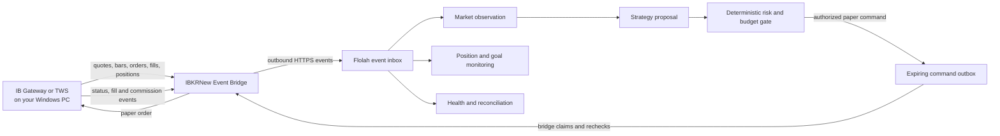

# IBKRNew0 event-driven paper trader

**Path:** **Prebuilt Workflows → IBKRNew0 → Strategy | Summary | Live Operations**

**Desktop download:** **Connectors → IBKRNew Event Bridge**

**Release boundary:** paper trading only. This is separate from the older IBKR Monthly Positive Return workflows.

IBKRNew0 reacts to broker and market events from a Windows desktop beside IB Gateway or TWS. Flolah does not connect from the cloud directly to the local Gateway, and there is no server-side price polling loop. The desktop bridge opens outbound HTTPS connections, streams market/broker callbacks, sends canonical events to Flolah, and claims short-lived signed paper commands.

> Trading involves risk. The supplied configuration is a paper-trading baseline, not financial advice or a promise of returns. Validate the strategy and broker entitlements with paper data before relying on any result.

## What “Paper trading only” means

IBKRNew0 can submit orders only when all of these are true:

- the active policy is `paper` and live execution remains disabled;
- the desktop bridge is explicitly enabled for paper execution;
- the locally selected IBKR account is a paper account;
- the active goal, strategy, universe, market data and risk checks all permit the order.

There is no live-account override in this release. Advisory and approval-required modes can further restrict execution.

## Start and event flow

The bridge must be running for new market events or commands to move. If the desktop, Gateway, data or cloud connection becomes stale, new entries fail closed. Existing broker-hosted protective orders remain at IBKR, while fills, closes, reconciliation and risk-reducing actions continue to be processed.

## Reactions, agents and responsibilities

IBKRNew0 is not one long workflow and does not contain a node that waits all day. It has six independent, short-lived event reactions:

| Reaction | Employee | Main events | Responsibility |
|---|---|---|---|
| Market observation | IBKRNewMarketObserver | bars, sessions, shortability, instrument/profile refreshes | Normalize desktop observations. |
| Strategy planning | IBKRNewStrategyPlanner | closed bars, regime changes | Apply the active goal, strategy skill and universe; propose only. |
| Risk checking | IBKRNewRiskChecker | signals, account snapshots, position changes | Enforce budgets, freshness, exposure, loss and commission rules deterministically. |
| Execution | IBKRNewExecutionOperator | authorized trades, order status | Deliver immutable, expiring paper commands to the correct bridge. |
| Position monitoring | IBKRNewPositionMonitor | fills, positions, hold/expiry windows | Track protection, commissions and goal-attributed realized outcomes. |
| Trading supervision | IBKRNewTradingSupervisor | disconnects, reconciliation mismatches, circuit breakers | Fail closed, report health and coordinate recovery without opening exposure. |

Each event is owner-scoped and idempotent. Retrying an acknowledged event must not create a second broker order.

## Configure the objective and trading rules

Open **IBKRNew0 → Strategy**. The tabs separate concerns:

- **Goal:** the measurable outcome and time boundary. The default is a configurable 5% net-realized return over 30 calendar days.
- **Strategy:** how eligible opportunities are proposed. The default is a configurable liquid US trend/pullback baseline.
- **Strategy skill:** instructions used by the strategy planner. It may propose a trade but cannot authorize or place one.
- **Policy:** deterministic switches, budgets, losses, position sizes, sessions, options, orders, commissions and allocation rules.
- **Universe:** eligible stock indices and independent ETF filters, liquidity/price rules and exclusions.
- **Market data:** required executable quotes, bars, shortability, account truth, instrument profiles, fundamentals and corporate events.

**Save** publishes a new owner-scoped configuration version to the database and retires the prior active version. An in-flight authorization keeps the exact versions it was checked against. A configuration may tighten immediately; no setting can bypass the paper-only safety floor or broker restrictions.

### Default conservative-to-moderate limits

- Total gross exposure: **USD 10,000**.
- Daily new opening exposure: **USD 1,000**.
- Maximum stock position: USD 750; maximum option premium position: USD 250.
- Maximum planned loss per trade: USD 50; daily loss limit: USD 150.
- Up to six open positions, including up to three long-option positions.
- Long stocks, short stocks, long calls and long puts are independently disableable.
- Short selling applies to stocks only. Short/naked/multi-leg options are not supported.

The total limit covers gross open exposure plus reserved opening exposure. Cash raised by a short sale does not create extra Flolah budget. The daily limit counts new opening exposure, not risk-reducing closes or buy-to-cover orders.

## Goal stop behavior

The active goal authorizes new opening exposure. Progress uses closed, goal-linked trades and **net realized profit after actual commissions**.

- **One time:** reaching the target or deadline stops new entries until a new goal is activated.
- **Perpetual:** the current cycle stops at its target or deadline; the next cycle starts only at the scheduled cycle boundary.
- **Pause:** blocks new opening trades until resumed.

Achieved, expired, completed, paused or waiting-for-capital goals do not block protective exits, closes, buy-to-cover, fills, commissions, reconciliation or health events for existing positions.

## Commissions and allocation

Before an entry, the risk gate compares estimated round-trip commission and regulatory fees with expected gross profit, expected net profit and reward/risk. It can reduce quantity or reject a trade when commission drag makes it uneconomic. A single trade may use more of the daily budget only when the configured confidence, net reward/risk, concentration and commission thresholds all pass.

After execution, actual broker commission events update the trade record. Summary and goal progress use realized results after those actual commissions, not only the estimate.

## Universe and market data

Stock and ETF selection are independent:

- use stock-index membership filters to narrow eligible stocks;
- use separate ETF include/exclude and eligibility rules;
- apply configured price, volume, spread and liquidity limits;
- require fresh shortability before a short-stock entry;
- require option chain, expiry, delta, open-interest, volume and spread rules for long calls/puts.

Executable quotes, bars, order/account/position truth and commissions come from IBKR through the local bridge. Fundamentals, index/ETF membership, instrument reference data and corporate events may come from licensed profile data configured for the bridge. Fundamentals support eligibility and event-risk filters; they are not the low-latency price trigger.

Only symbols assigned by the active universe should be subscribed. Data entitlements and exchange permissions remain the responsibility of the IBKR paper account.

## Install the one desktop service

1. Install and sign in to IB Gateway or TWS on the Windows trading PC; enable its local API for the paper session.
2. In Flolah, open **Connectors → IBKRNew Event Bridge**.
3. Download the full package (portable runtime included) or lite package (local compatible runtime required).
4. Extract it to a private local folder. Keep the generated environment file and token private.
5. Configure the Gateway host/port, a dedicated client ID, and the paper account **only on that PC**.
6. Start in observe-only mode. Confirm Gateway, bridge and market-data health in **Live Operations**.
7. Enable paper execution locally only after subscriptions, account state, positions and reconciliation are healthy.

The package runs one IBKRNew bridge service/process. The six event reactions run in Flolah; no workflow package is downloaded to the desktop. Revoking a bridge in Live Operations invalidates its token and pending commands.

## Monitor and troubleshoot

**Summary** shows commission-adjusted outcomes, goal-cycle progress and allocation decisions. **Live Operations** shows bridge/Gateway/component health, heartbeats, cached instrument profiles, positions, executions, approvals, errors and recent history. Records follow the owner’s configured retention policy.

Before expecting a paper order, verify:

1. Goal state is active and cycle capital is available.
2. Trading and the desired instrument/direction switches are enabled.
3. The desktop bridge and Gateway show online and reconciled.
4. Quote, feature, account, shortability and instrument data are fresh.
5. The symbol passes the active stock-index or ETF universe filters.
6. Total, daily, position, loss and commission gates have capacity.
7. Any required CEO approval is still within its expiry window.

On disconnect or uncertain submission, do not manually replay a command. Restore Gateway/bridge connectivity and let reconciliation resolve open orders, executions and positions before enabling new entries.

## Privacy and sensitive data

The real IBKR account number is configured locally and must not be entered in Flolah chat or browser forms. Flolah stores a random opaque account reference, owner-scoped events/projections, configuration versions, positions, orders, fills, commissions, health and audit records. Bridge credentials are generated per owner/bridge, stored hashed on the server, and shown only as needed in the downloaded package.

Do not upload the downloaded environment file, bridge token, Gateway credentials, account number, statements or diagnostic logs containing them to Master Data or a public issue. Revoke the bridge and generate a new package if its token may have been exposed.

## Related

- **Older monthly strategy:** [IBKR Monthly Positive Return](./20-ibkr-monthly-trading.md) — separate workflows and data.
- **Connector packages:** [Connectors and OpenConnector](./16-connectors-openconnector.md).
- **External package tokens:** [Tokens management](./34-tokens-management.md).
- **Retention:** [Scheduled jobs and data retention](./19-scheduled-jobs-and-crons.md).
